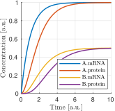

Examples
========

To simplify and streamline the modeling tasks, OneModel allows us to create incremental implementations of a model by using smaller models previously defined.
In the following sections, we present two case scenarios to show how to work with OneModel and how these ideas can be carried out with its syntax in an easy way. 
These case scenarios demonstrate how to use OneModel software. 

We used the following software tools to perform the examples: Matlab R2020b, Python v3.8.0, and OneModel v0.0.10. 
We recommend using the same software versions to replicate the examples.

Constitutive protein expression
-------------------------------

In this section, we show an example of how to model constitutive protein expression using OneModel syntax.
The code examples are easy-to-follow, and they are well commented: there is no need to know OneModel syntax to follow them.
Moreover, it shows the benefits of using OneModel syntax for modeling synthetic biology circuits.

Protein expression---in this chapter, we use protein expression and gene expression interchangeably, as we will implement models of gene expression leading to the synthesis of proteins---is a complex process that involves many reactions and interactions.
For this example, we simplify this process, and we take into account mRNA transcription, protein translation, and degradation of mRNA and protein:

.. _reactions:

  Reactions of constitutive protein expression

where ``mRNA`` and ``protein`` are the mRNA and protein concentration (we could alternatively work with the number of molecules of each species instead of working with concentrations); ``k_m`` and ``k_p`` are the rate constants related to transcription and translation, respectively; and ``d_m`` and ``d_p`` are the degradation rate constants of the mRNA and the protein.

In the set of reactions of :numref:`reactions`, there are three different classes of model-elements: species (``mRNA`` and ``protein``), parameters (``k_m``, ``k_p``, ``d_m`` and ``d_p``) and the reactions.
These are the elements that we have to implement using the OneModel syntax.

:numref:`basic_mRNA_and_protein` implements the model-elements in :numref:`reactions` using OneModel syntax.
Lines 3--6 define mRNA and protein as species and set their initial values to zero.
Lines 8--13 define the parameters and set their values to one (for example purposes).
Moreover, lines 15--20 define the reactions, with their explicit reaction rates placed after the ``;`` symbol.
Note that texts after a ``#`` symbol are comments which are only used to explain the function of the code.

.. _basic_mRNA_and_Protein:
.. code-block:: 
  :caption: Example of modeling constitutive gene expression (transcription, translation and degradation) using OneModel.

  ### Simple gene expression model. ###
  
  species       # Start declaring species.
    mRNA=0      # mRNA concentration.
    protein=0   # Protein concentration.
  end           # End declaring species.
  
  parameter     # Start declaring parameters.
    k_m=1       # mRNA transcription rate.
    d_m=1       # mRNA degradation rate.
    k_p=1       # Protein translation rate.
    d_p=1       # Protein degradation rate.
  end           # End delaring parameters.
  
  reaction                                # Start declaring reactions.
    0 -> mRNA              ; k_m          # mRNA transcription.
    mRNA -> 0              ; d_m*mRNA     # mRNA degradation.
    mRNA -> mRNA + protein ; k_p*mRNA     # Protein translation.
    protein -> 0           ; d_p*protein  # Protein degradation.
  end                                     # Stop declaring reactions.

:numref:`basic_mRNA_and_protein_sim` shows a simulation of this code.
Once we have the OneModel implementation, we can use SBML2dae to generate a Matlab implementation of the OneModel code to simulate it.
This way, if the simulation result is coherent, we can validate the OneModel code and continue with this example.

.. _basic_mRNA_and_protein_sim:
.. figure:: ../images/examples/ex01_simple_gene_expression.svg
  :align: center
  :width: 300
  :alt: simple gene expression simulation

  In blue is shown mRNA concentration and in red protein concentration. All units are arbitrary.

A synthetic circuit rarely consists of the expression of just one protein.
Typically they are composed of several proteins (two, or three, even hundreds of them).
As a result, the mathematical models tend to get very repetitive because it is necessary to replicate the set of reactions for each of the proteins.

One of the most common approaches to this problem is to implement each protein's reactions and equations by hand: copy-pasting the code and thus making a monolithic model.
Copy-pasting is a bad programming practice, and it should be avoided.
Models of this type are hard to maintain and to use.
Indeed, this bad programming practice is due to using software that does not allow incremental and/or modular modeling.

:numref:`two_genes_expression_bad` is an example of this bad programming practice.
What we have done in this example is to copy-paste the :numref:`basic_mRNA_and_protein` twice.
We have changed the name of species and parameters to create one set of species and parameters for the constitutive expression of protein A and another set for protein B.
This code is hard to read, and this situation will worsen with each extra protein we want to add to the model: we developed OneModel to avoid this type of situations.

.. _two_genes_expression_bad:
.. code-block:: 
  :caption: Example of bad programming practices to avoid. Here is modeled the expression of two genes by copy and pasting the :numref:`basic_mRNA_and_protein`. 

  ### How NOT to model the expression of two genes. ###

  species         
    mRNA_A=0, protein_A=0   # Gene A mRNA and protein concentration.
    mRNA_B=0, protein_B=0   # Gene A mRNA and protein concentration.
  end
  
  parameter
    k_m_A=1,  d_m_A=1   # Transcription and degradation rates of mRNA A.
    k_p_A=1,  d_p_A=1   # Translation and degradation rates of protein A.
    k_m_B=1,  d_m_B=1   # Transcription and degradation rates of mRNA B.
    k_p_B=1,  d_p_B=1   # Translation and degradation rates of protein B.
  end
  
  reaction
    0 -> mRNA_A                  ; k_m_A           # Transcription mRNA A.
    mRNA_A -> 0                  ; d_m_A*mRNA_A    # Degradation mRNA A.
    mRNA_A -> mRNA_A + protein_A ; k_p_A*mRNA_A    # Translation protein A.
    protein_A -> 0               ; d_p_A*protein_A # Degradation protein A.
    0 -> mRNA_B                  ; k_m_B           # Transcription mRNA B.
    mRNA_B -> 0                  ; d_m_B*mRNA_B    # Degradation mRNA B.
    mRNA_B -> mRNA_B + protein_B ; k_p_B*mRNA_B    # Translation protein B.
    protein_B -> 0               ; d_p_B*protein_B # Degradation protein B.
  end

The efficient solution to this problem is to use modularity.
OneModel syntax allows us to wrap :numref:`basic_mRNA_and_protein` as a ``model``.
We group all the species, parameters, and reactions as a module which we can reuse by instantiating it as objects instead of copy-pasting the code for each protein.
This way, we avoid copy-pasting the code for each protein.
Instead, we can create multiple instances of this model.

:numref:`protein_constitutive` shows how to implement :numref:`basic_mRNA_and_protein` as a ``model``.
This process is easy to do; we need to wrap the previous code inside the ``model`` and ``end`` keywords (lines 4--19).
This way, ``ProteinConstitutive`` is a constructor which will generate instances of the model for us.

In the ``standalone`` block, we show an example of using ``ProteinConstitutive``.
We have just created object A which is an instance of model ``ProteinConstitutive``.
Object A has a copy of all the model-elements of ``ProteinConstitutive``, and they are accessible by the use of the ``.`` operator. For example, the mRNA concentration of object A can be accessed as ``A.mRNA``.

.. _protein_constitutive:
.. code-block::
  :caption: Example of how to build a reusable model for constitutive gene expression using OneModel syntax.

  ### Definition of ProteinConstitutive. ###
  
  ## ProteinConstitutive models constitutive gene expression. ##
  model ProteinConstitutive  # Start declaring model.
  
    species mRNA=0, protein=0  # mRNA and protein concentration.
    
    parameter
      k_m=1, d_m=1  # mRNA transcription and degradation rate.
      k_p=1, d_p=1  # Protein translation and degradation rate.
    end
    
    reaction
      0 -> mRNA              ; k_m          # mRNA transcription.
      mRNA -> 0              ; d_m*mRNA     # mRNA degradation.
      mRNA -> mRNA + protein ; k_p*mRNA     # Protein translation.
      protein -> 0           ; d_p*protein  # Protein degradation.
    end
  end  # End declaring model.
  
  ## Example of how to use ProteinConstitutive. ##
  standalone        
    A = ProteinConstitutive()
  end

:numref:`two_genes_expression` shows how easy it is to model the expression of two proteins taking advantage of the previously defined model.
First, we must import the previous code into the new model (line 5).
And then, we just need to create as many proteins as we need by writing lines 8--9.
Declaring models and instantiating objects is an efficient way to model the expression of two proteins.

.. _two_genes_expression:
.. code-block::
  :caption: Example of how to use the model defined in :numref:`protein_constitutive` to model the expression of two genes.

  ### How to model the expression of two proteins. ###

  # Import ProteinConstitutive model.
  # (note that the standalone code is not imported).
  import './ex03_protein_constitutive.one'
  
  # Initialize A and B as instances of ProteinConstitutive.
  A = ProteinConstitutive()
  B = ProteinConstitutive()
  
  # We could easily add more proteins by writing:
  # C = ProteinConstitutive()
  # ...

Induced protein expression
--------------------------
  
``ProteinConstitutive`` models genes that are constitutive expressed.
In many synthetic circuits, the presence of a transcription factor (which could also be a protein) can induce gene expression.
This section, we show how to create another model for induced protein expression.

As a first approach, we could create a new model by copy-pasting the code of ``ProteinConstitutive`` and modifying it to make the expression inducible: this would be another type of bad programming practice.
Doing that is equivalent to what we did in :numref:`two_genes_expression_bad`, and it would lead to an inefficient workflow because each time we want to define a new ``model`` we will have to duplicate the transcription and translation reactions.

  Whenever you are tempted to copy-pasting any part of your code: stop doing it; it is an indicator that there is a better way to do it.
  Take the time to see if someone else has stumbled upon your problem---it's a golden opportunity to improve your programming skills---.

In the previous case, the solution was to implement a ``model`` instead of copy-pasting the code.
Here the solution is to create a new ``model`` by extending the functionality of ``ProteinConstitutive``.

.. _protein_induced:
.. code-block::
  :caption: Example of modeling induced gene expression by extending the previously defined ``ProteinConstitutive`` model.

  ### Definition of ProteinInduced. ###
  
  import 'ex03_protein_constitutive.one'
  
  ## ProteinInduced extends the ProteinConstitutive model to make ##
  ## the expression inducible by a transcription factor.          ##
  model ProteinInduced(ProteinConstitutive)
  
    input TF       # Define the transcription factor as an input.
    species k_m=0  # Override the parameter k_m to be a species.
    
    parameter
      h = 1        # Half-activation threshold.
      k_m_max = 1  # Maximum transcription rate.
    end
    
    # Set the value of k_m as an substitution equation.
    rule k_m := k_m_max * TF/(TF+h)
  end
  
  ## Example of how to use ProteinInduced. ##
  standalone
    A = ProteinConstitutive()
    B = ProteinInduced()
  
    rule B.TF := A.protein  # Set protein A as the transcription factor of B.
  end

:numref:`protein_induced` shows the definition of a new model ``ProteinInduced`` by extending ``ProteinConstitutive``.
First, we have to import the code of ``ProteinConstitutive`` (line 3).
We declare ``ProteinInduced`` model and we set ``ProteinConstitutive`` as its parent (note that the name of ``ProteinConstitutive`` is in the parentheses in line 7).
This way, ``ProteinInduced`` will have all the model-elements defined in its parent.
The rest of the work is to add the inducible part to the model.
For this, we do not need to change the reactions; we just need the value of parameter ``k_m`` to change depending on the transcription factor concentration.
To this end, we declare the transcription factor ``TF`` as an input (line 9).
We override the parameter ``k_m`` to be a species in line 10 (note that the declaration of species refers both to chemical species or to state variables).
The last step is to declare the parameters for a Hill-like function (lines 13--14) and assign the value of ``k_m`` as the Hill function using the substitution rule.

The ``standalone`` example (lines 22--26) models a constitutively expressed protein A and a protein B which is induced by A.
:numref:`protein_induced_sim` shows a simulation of ``ProteinInduced``.

.. _protein_induced_sim:

  Simulation of ``ex05_protein_induced.one``. Protein A is expressed constitutively, and protein B expression is induced by protein A. The mRNA and protein concentration of gene A are shown in blue and red, and the ones of gene B are shown in yellow and purple. All units are arbitrary.

..
  \subsection{Antithetic controller}
  
  To exemplify more complex gene circuits, in this section, we model an antithetic controller making use of the models for constitutive and induced protein expression defined in the previous sections.
  
  The antithetic controller is a synthetic gene system to robustly control the expression of a protein of interest \parencite{Aoki2019}.
  This circuit is implemented using three genes coding three proteins: sigma $z_1$, anti-sigma $z_2$, and the protein of interest $x$.
  Normally, $z_1$ is constitutively expressed and induces the production of $x$. In turn, $x$ activates the expression of $z_2$.
  Finally, $z_1$ and $z_2$ annihilate each other in a sequestration reaction, thus closing the loop.
  
  The following set of reactions shows all the biochemical reactions in this gene circuit.
  The reactions related to protein expression and degradation:
  
  \begin{equation}\label{eq:antithetic_a}
  \begin{aligned}
    \ce{$\emptyset$ &->[k_m^{z1}] m_{z1}}\\
    \ce{m_{z1} &->[d_m^{z1}] \emptyset}\\
    \ce{m_{z1} &->[k_p^{z1}] m_{z1} + z1}\\
    \ce{z1 &->[d_p^{z1}] \emptyset}\\
  \end{aligned}
  \quad\quad
  \begin{aligned}
    \ce{$\emptyset$ &->[k_m^{z2} f(x)] m_{z2}}\\
    \ce{m_{z2} &->[d_m^{z2}] \emptyset}\\
    \ce{m_{z2} &->[k_p^{z2}] m_{z2} + z2}\\
    \ce{z2 &->[d_p^{z2}] \emptyset}\\
  \end{aligned}
  \quad\quad
  \begin{aligned}
    \ce{$\emptyset$ &->[k_m^{x} g(z_1)] m_{x}}\\
    \ce{m_{x} &->[d_m^{x}] \emptyset}\\
    \ce{m_{x} &->[k_p^{x}] m_{x} + x}\\
    \ce{x &->[d_p^{x}] \emptyset}\\
  \end{aligned}
  \end{equation}
  
  and the sequestration reaction:
  
  \begin{equation}\label{eq:antithetic_b}
    \ce{z1 + z2 ->[$\gamma$] \emptyset} \,,
  \end{equation}
  where $m_{i}$ are the mRNA concentration of $z_1$, $z_2$ and $x$; $k_m^i$ and $k_p^i$ are the rate constant parameters related to transcription and translation, respectively; $d_m^i$ and $d_p^i$  are the degradation rate constants of mRNA and protein; $f(x)$ and $g(z_1)$ are activation Hill-like functions; and $\gamma$ is the antithetical sequestration rate constant.
  
  Note that in \eqref{eq:antithetic_a} there are a lot of repetitive reactions to model the expression of $z_1$, $z_2$, and $x$.
  We can take advantage of this repetitive structure and use the model for protein expression that we defined before.
  
  Code \ref{lst:antithetic_controller} is an implementation of the \onemodelline{AntitheticController} model using the models \onemodelline{ProteinConstitutive} and \onemodelline{ProteinInduced}.
  
  First, we have to import the previous models into this new one (line 3).
  Note that \onemodelline{'ex05_protein_induced.one'} already imports \onemodelline{ProteinConstitutive}.
  We define the three proteins which make the circuit. We use \onemodelline{ProteinConstitutive} for protein \onemodelline{z1} and \onemodelline{ProteinInduced} for proteins \onemodelline{z2} and \onemodelline{x} (lines 6--8).
  We define the annihilation rate constant \onemodelline{gamma} (line 9), and we add the annihilation reaction to the model (line 14).
  
  Note that if we define models using reactions (instead of rules), we can add more reactions to previously defined models, and \textit{OneModel} will update all the rates of changes of the species automatically---this makes it very easy to expand the functionality of models as we have done with adding the antithetic reaction in Code \ref{lst:antithetic_controller}.
  
  \inputOneModel{
    ./examples/03_onemodel/model/ex06_antithetic_controller.one
  }{
    Example of modeling an antithetic controller using \textit{OneModel} syntax. \label{lst:antithetic_controller}
  }
  
  Then, we set \onemodelline{z1} as the transcription factor of protein \onemodelline{x}. In turn, \onemodelline{x} will be the transcription factor of protein \onemodelline{z2} (lines 18--19).
  Finally, we set the standalone example as just the AntitheticController.
  Figure \ref{fig:antithetic_controller_sim} shows a simulation of the \onemodelline{AntitheticController} model.
  
  \begin{figure}[H]
    \centering
    \includegraphics{./examples/03_onemodel/figs/ex06_antithetic_controller.eps}
    \caption{Simulation of \texttt{ex06\_antithetic\_controller.one}. The concentration of sigma protein $z_1$ is shown in blue, in red the anti-sigma concentration z2 and in yellow the protein of interest x. All units are arbitrary.\label{fig:antithetic_controller_sim}}
  \end{figure}
  
  \subsection{Host-aware antithetic controller}
  
  This last example shows the use of \textit{OneModel} with complex and large models.
  The first approach to model a synthetic gene circuit is usually done by neglecting the interactions between the host cell and the gene circuit.
  However, there is an increasing need to include host dynamics to improve model prediction capabilities.
  These host-aware dynamic models are complex and not easy to implement since they may contain several states and equations \parencite{Santos2021}.
  
  Code \ref{lst:WildType} depicts the \onemodelline{WildType} model that represents the host-aware model freely distributed with \textit{OneModel}.
  Lines 8--17 show an incomplete representation of it just for demonstration purposes.
  This model implements the equations from the host-aware model of Chapter 2 and takes into account the host dynamics, the competition for cell resources in protein expression, and its effect on cell growth.
  The model \onemodelline{WildType} is rather complex.
  However, from a user perspective, we only need to know how to modify its input \onemodelline{WSum} (line 10), which is a value that keeps track of the burden introduced by the expression of exogenous proteins like the ones introduced by the antithetic controller.
  \onemodelline{WildType_ProteinConstitutive} is a model provided also by \onemodelline{WildType}, which defines the base protein expression mechanism.
  The user may use this model as a building block for its own circuits (similarly to section \ref{sec:constitutive_protein_expression}).
  There were no inputs in the original \onemodelline{ProteinConstitutive}. However \onemodelline{WildType_ProteinConstitutive} is a more complex model which has inputs to calculate protein expression as function of the effective translation rate of ribosomes \onemodelline{nu_t}, and the cell growth rate \onemodelline{mu}.
  
  
  \inputOneModel{
    ./examples/03_onemodel/model/ex07_wild_type.one
  }{
    \onemodelline{WildType} is the host-aware model freely distributed with \textit{OneModel}, \onemodelline{WildType_ProteinConstitutive} is the constitutive protein expression mechanism, and \onemodelline{WildType_ProteinInduced} is the inucible protein experssion mechanism. The figure shows an incomplete representation of these models only for the example purposes.\label{lst:WildType}
  }
  
  Code \ref{lst:WildTypeAntitheticController} shows the \onemodelline{WildType_AntitheticController} model that is the implementation of the antithetic controller taking into account the host dynamics.
  
  First, in line 2 we import the \onemodelline{WildType}, the \onemodelline{WildType_ProteinConstitutive} and the \onemodelline{WildType_ProteinInduced} models.
  Then in line 4, we declare a new model \onemodelline{WildType_AntitheticController} as an extension of \onemodelline{WildType} model; this way, we have all the dynamics of the host, and we only need to add the remaining dynamics of the antithetic controller.
  In lines 5--8, we define the proteins of the antithetic controller, sigma \onemodelline{z1} as a constitutive expressed protein and anti-sigma and the protein of interest (\onemodelline{z2} and \onemodelline{x}) as induced expressed proteins.
  The \onemodelline{WildType} model needs to know if any of the proteins are under active degradation to ensure that the cell mass is calculated correctly. Therefore we cannot implement the antithetic reaction as we did in Code \ref{lst:antithetic_controller}.
  However, there is a simple workaround; we can define the complex sigma and anti-sigma \onemodelline{z12} (line 7) that is not expressed directly by the cell (line 10) but is generated as a result of the sequestration reaction of the antithetic controller (line 17).
  The rest we have to do in the model is to set up the antithetic controller (lines 21--22) and calculate the total burden generated by the exogenous proteins (line 26).
  Finally, we have to satisfy the inputs for each protein (lines 30--32); this step is omitted in the example for brevity.
  
  \inputOneModel{
    ./examples/03_onemodel/model/ex08_antithetic_controller.one
  }{
    Example of how to model a host-aware antithetic controller with \textit{OneModel} syntax.\label{lst:WildTypeAntitheticController}
  }
  
  Figure \ref{fig:host_aware_sim} shows a set of simulations of the host-aware antithetic controller performed with \textit{SBML2dae}.
  In these simulations, we have considered two simplifications of the model: (i) to neglect the burden produced by the antithetic controller to the host---this is done by removing the \onemodelline{z1.W + z2.W + z12.W} term from line 26 of Code \ref{lst:WildTypeAntitheticController}---, and (ii) to neglect the dilution of the sigma and anti-sigma factors of the antithetic controller.
  
  \begin{figure}[h]
    \centering
    \includegraphics[]{examples/03_onemodel/figs/Example_03.eps}
    \caption{
      Set of simulations of the host-aware antithetic controller, each line corresponds to a simulation with different conditions.
      The solid lines correspond to simulations that neglect the dilution of the sigma and anti-sigma factors on the antithetic controller, while the dashed lines correspond to simulations that take dilution into account.
      The blue lines correspond to simulations that neglect the burden produced by the antithetic controller to the host, and the red lines correspond to simulations in which this burden is taken into account.
      The left plot shows the protein of interest $x$ to be controlled by the antithetic controller, the reference of the antithetic controller was set to \SI{70}{fg} (see Section \ref{ac_host:sec:ideal_antithetic} for more information about the antithetic controller's reference) .
      The right plot shows the host growth rate.
    }\label{fig:host_aware_sim}
  \end{figure}
  
  If we neglect the burden produced by the antithetic controller (blue lines), we can see how the growth rate does not change during simulation time (both solid and dashed blue lines overlap in the plot). However, if we consider that burden (red lines), we see how the growth rates vary accordingly---because now the host is using resources to express the antithetic controller instead of using them to grow.
  
  Suppose we neglect the dilution of the sigma and anti-sigma factors (solid lines). In that case, the antithetic controller will preserve the integral action, which makes $x$ to reach the reference of \SI{70}{fg} in the solid blue line, however in the solid red line (where the burden is taken into account) the $x$ still gets to the reference (this is not shown in the figure) but it takes much more time---due to effect of the integral action is diminished due to the cell is growing slower---. However, if we consider the dilution (dashed lines), the antithetic controller loses the integral action and never achieves the reference value.
  
  We have done this because it is an excellent example of showing the flexibility of the \textit{OneModel} workflow; it is straightforward to perform multiple simulations with different conditions taking advantage of the modularity.
