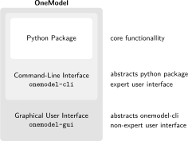

OneModel implementation
=======================

OneModel was implemented in Python because it is an open-source programming language, is easy to learn, and bridges the gap between compatibility with other programs. Lastly, its extensive libraries facilitated OneModel development.

OneModel defines a domain specific language: the OneModel syntax.
This syntax has been implemented using TatSu, which allows us to create syntax parsers conveniently and powerfully.
This makes the OneModel syntax easily modifiable and adaptable.
One advantage of developing a domain-specific language (instead of having implemented just a Python library) is that it lowers the entry barriers for the user: there is no need to learn Python.
Examples of successful domain-specific languages are HTML (HyperText Markup Language) and CSS (Cascading Style Sheets), pseudo programming languages for non-expert users.
In addition, the use of a domain-specific language allows the definition of high-level concepts (such as functions, classes, etc.) that are not currently available in SBML.

  Domain-specific languages are an excellent tool for automating repetitive tasks and improving productivity---they are at the core of OneModel's development---.
  I highly recommend to learn the why and how of creating domain-specific languages.

OneModel uses libSBML, a library that simplifies reading and writing SBML files, and it is widely used in the SBML community to export models as SBML code.

The following figure shows the internal structure of OneModel.
The core functionality was developed as a Python package.
OneModel provides two different interfaces to simplify and abstract the use of the Python package:
the command-line interface, and the graphical user interface.
The command-line interface can be used directly by an expert user, and it has been developed with Click, a package that allows us to implement professional command-line interfaces.
However, using a command-line interface is far from ideal for a non-expert user.

  Internal structure of OneModel, where its core is a Python package. The command-line interface abstracts the functionality of the python package, and the graphical user interface represents the functionality of the command-line interface.

The following figure shows the OneModel graphical user interface. It abstracts the use of the command-line interface, and it is a good interface for non-expert users.
The graphical user interface was built using PyQt5, a Python package for developing graphical-user interfaces that can run in any operating system.

.. figure:: ../images/usage/onemodel_gui.png
  :align: center
  :width: 700
  :alt: onemodel-gui screenshot

  OneModel graphical user interface running in Linux Mint 19. This graphical interface can be setup in Windows, Mac, and Linux, and it provides a simple text-editor with a syntax highlighter for OneModel.

